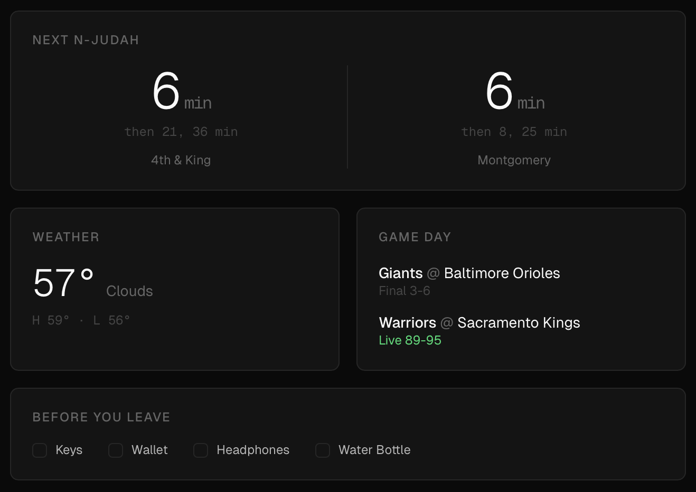

# SF Dashboard

A live city dashboard for San Francisco, built for the [TRMNL](https://usetrmnl.com) e-ink display.

Shows real-time MUNI N-Judah departures, current weather, Giants/Warriors game day alerts (with a crowd warning for home games), and a daily carry checklist. Data is fetched from public APIs and served as TRMNL Framework v3 markup.



## What It Shows

| Panel | Source | What |
|-------|--------|------|
| **N-Judah** | 511.org SIRI | Next departures from 4th & King and Montgomery |
| **Weather** | OpenWeatherMap | Current temp, conditions, high/low |
| **Game Day** | ESPN Scoreboard | Giants and Warriors games today, home game crowd warnings |
| **Checklist** | Static | Keys, Wallet, Headphones, Water Bottle |

## How It Works

```
511.org ──┐
OWM ──────┤
ESPN ─────┼──▶ Next.js API ──▶ TRMNL Framework HTML ──▶ TRMNL device
Checklist ┘        │
                   └──▶ /preview (browser preview at 800x480 and 1872x1404)
```

The TRMNL device polls `/api/trmnl/polling` on a schedule. The endpoint fetches live data, builds HTML using TRMNL Framework v3 classes, and returns `{ markup }`. A Vercel Cron job at `/api/trmnl/cron` can also push updates via webhook.

The `/preview` page renders the exact same markup inside iframes with the TRMNL Framework CSS, simulating both the TRMNL OG (800x480) and TRMNL X (1872x1404) at actual pixel dimensions.

## Stack

- **Next.js 16** / React 19 / TypeScript
- **Tailwind CSS v4**
- **TRMNL Framework v3** for e-ink markup
- **Vercel** for hosting + cron

## Setup

```bash
git clone https://github.com/blancas-armando/sf-dashboard.git
cd sf-dashboard
npm install
```

Copy `.env.example` to `.env.local` and fill in your keys:

```bash
cp .env.example .env.local
```

| Variable | Where to get it |
|----------|----------------|
| `TRANSIT_511_API_KEY` | [511.org/open-data](https://511.org/open-data) (free, instant) |
| `OPENWEATHERMAP_API_KEY` | [openweathermap.org](https://openweathermap.org/api) (free tier) |
| `TRMNL_WEBHOOK_URL` | TRMNL dashboard (after creating a Private Plugin) |
| `TRMNL_PLUGIN_UUID` | TRMNL dashboard |
| `CRON_SECRET` | Any random string (secures the cron endpoint) |

ESPN's scoreboard API requires no key.

```bash
npm run dev
```

Open `http://localhost:3000/preview` to see the e-ink output.

## TRMNL Plugin Setup

1. In the TRMNL dashboard, create a **Private Plugin** with the **Polling** strategy
2. Set the polling URL to `https://your-vercel-url.vercel.app/api/trmnl/polling`
3. The device will fetch and render the dashboard on its refresh cycle

## Project Structure

```
src/
  lib/
    dashboard.ts    # Shared data fetcher (all sources + error handling)
    transit.ts      # 511.org SIRI API → N-Judah departures
    weather.ts      # OpenWeatherMap → current conditions
    games.ts        # ESPN Scoreboard → Giants/Warriors
    checklist.ts    # Static checklist items
    trmnl.ts        # Builds TRMNL Framework v3 HTML markup
    types.ts        # Shared TypeScript types
  app/
    page.tsx        # Web dashboard (dev/debug view)
    preview/        # E-ink preview at actual TRMNL dimensions
    api/
      dashboard/    # JSON endpoint (web polling)
      trmnl/
        polling/    # TRMNL polling endpoint → { markup }
        cron/       # Vercel Cron → push to TRMNL webhook
  components/       # React panels for the web view
```

## License

MIT
